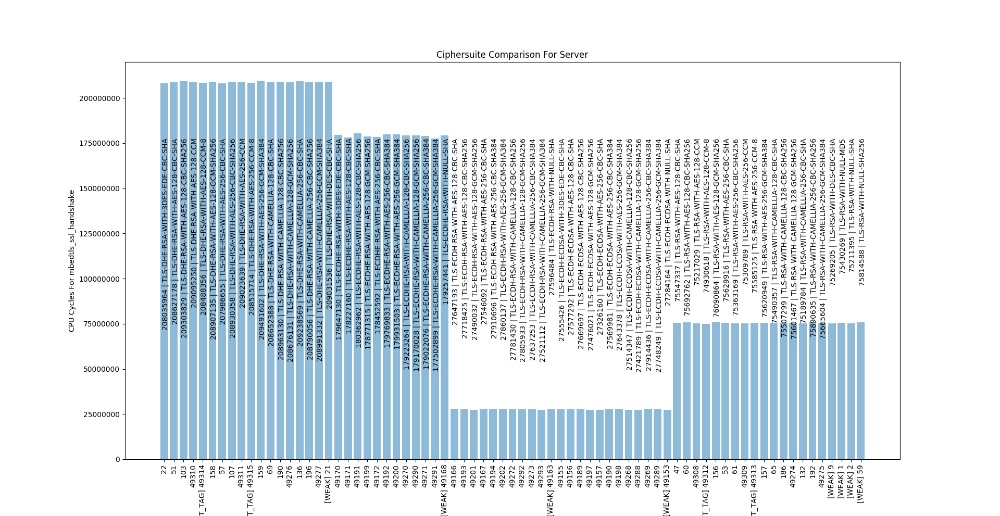

# Callgrind CPU Cycles Counter With Graph Production

This is a project-specific program that I've written to automate the
profiling of the various `Transport Layer Security (TLS)` ciphersuites.

The tool does the following:

* Runs a client/server connection with a list of provided ciphersuites
* Profiles each ciphersuite run
  * for user-specified client and server functions
    * can be different functions for the client and the server
* Parses the number of CPU Cycles used by each function for each ciphersuite
* Outputs a graph with the results

If any of the runs produces an error (e.g. unsupported cipehsuite,
  like if your server does not have `PSK` configured, yet you're
  trying to use a `PSK` ciphersuite), it will simply be skipped,
  the program will not crash.

I wrote this when profiling the [mbedTLS](https://tls.mbed.org/) library, the code is not mbedTLS-specific however. It is project-specific in the sense that
it runs a client program in one thread and a server program in another thread
and provides the ciphersuite id as an argument to both.

It produces graphs like the following one:



# Running and Requirements

To run this tool you will need to have:
* `valgrind` installed on your system and in your `PATH`
* `Python 3.6` installed (it needs to be `3.6` due to the use of the [formatted string literals](https://www.python.org/dev/peps/pep-0498/). If your replace those in the code you can use older `Python 3` versions)

To install the dependencies, run the following command:

```
pip install -r requirements.txt
```

After that, you're ready to run the program. To do that, use the file at `run.py`.

## Important Note

When compiling your `.c` files, **do not** compile/link with the `-pg`
option, otherwise you might get `-27 (SIGTTOU)` return codes
from `valgrind`. This is because you **can't** use `valgrind` with
`gprof`, otherwise, sometimes you might get `Profiling timer has expired`
messages at the end of a `valgrind` execution.

I've added `-27` return code statistics print at the end of the program
execution.

# Usage

It's a command-line tool. Run `python run.py --help` to show the
help string.

```
usage: run.py [-h] [--sf [SF [SF ...]]] [--cf [CF [CF ...]]] [-k] [-t TIMEOUT]
              [-v]
              client server ciphersuite_list

Run mbedTLS server and client program and collect profiling metrics for a list
of ciphersuties.

positional arguments:
  client                client program path
  server                server program path
  ciphersuite_list      path to file containing a list of cipherstuies (format
                        per line: ciphersuite_ID ciphersutie_name
                        ciphersuite_flags)

optional arguments:
  -h, --help            show this help message and exit
  --sf [SF [SF ...]]    name of server functions to profile
  --cf [CF [CF ...]]    name of client functions to profile
  -k, --keep-callgrind-output
                        Keep the output callgrind files after the program has
                        finished running
  -t TIMEOUT, --timeout TIMEOUT
                        time to wait after starting the server before starting
                        the client
  -v, --verbose         Enable verbose output

```

# Examples

The [examples]() folder has the example input programs that you can
use to test the tool or adapt it to your own needs.

The provided `.c` files will not compile if you try to do it
from within the `examples` directory, since they need
various `mbedTLS` dependencies, which were not included here.

The `ciphers.txt` file is generated by running the
`./examples/ciphersuites_list` program. It gets the list of
enabled ciphersuites of your `mbedTLS` configuration and dumps
them into into the standard output.

## Example Commands:

`python run.py ./examples/client ./examples/server ./examples/ciphers.txt --sf mbedtls_ssl_handshake --cf mbedtls_ssl_handshake
`
Will run the server in one thread, wait for `2` seconds (default value),
run the client in another thread, wait for `2` seconds (default)
value. There will be `91` runs of those (number of ciphersuites
  in `./examples/ciphers.txt`) and in each the client and the server
will be provided with the ciphersuite id as an argument.
The [mbedtls_ssl_handshake](https://tls.mbed.org/api/ssl_8h.html#a4a37e497cd08c896870a42b1b618186e) function will be profiled for both,
the client and the server. At the end, there will be two graphs
produced.
At the end, all of the `callgrind.out.*` files will be removed.

`python run.py ./examples/client ./examples/server ./examples/ciphers.txt --sf mbedtls_ssl_read mbedtls_ssl_write ssl_encrypt_buf ssl_decrypt_buf mbedtls_ssl_handshake --cf mbedtls_ssl_read mbedtls_ssl_write ssl_encrypt_buf ssl_decrypt_buf -k`

Similar to the command above, except that `5` server functions
will be profiled and `4` client functions will be profiled. This
means that you will have `9` graphs produced. The `-k` option
tell the program not to delete the `callgrind.out.*` files, which
means that you will now have them available for your own uses
(e.g. examine them manually with the `kcachegrind` tool).

All of the example files were compiled and run on my
local machine only (Arch Linux):

```
$ uname -a
Linux KGB-AGENT-1992 4.15.13-1-ARCH #1 SMP PREEMPT Sun Mar 25 11:27:57 UTC 2018 x86_64 GNU/Linux
```

# How It Works

In short, the tool runs the user-provided client and server executables
wrapped with `valgrind` like so: `valgrind --tool=callgrind --callgrind-out-file <out_file> --quiet <executable>`. After that, it
parses the number of CPU Cycles for the user-provided function name(s) from
the `<out_file>`. It then uses those numbers to produce a graph.

# Who Is This For

Please note, this tool was written to solve a specific need quickly.
The code quality is not the best, it was written in a script-like fashion.

I decided to publish this for any of you who are looking to automate
profiling tasks based on `valgrind` or similar tools. I didn't find
anything similar in the open-source community. You can use
this code as an example to adapt it to your own needs.

If you have any questions or need help, don't hesitate to contact me.
